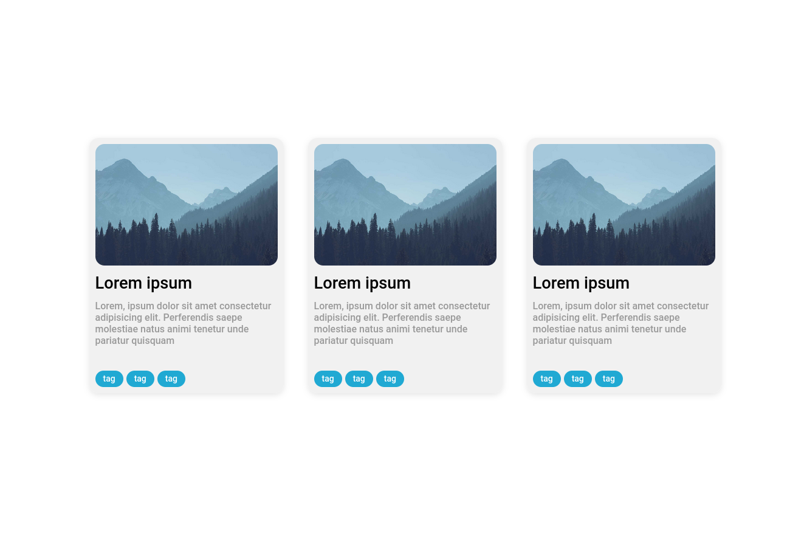
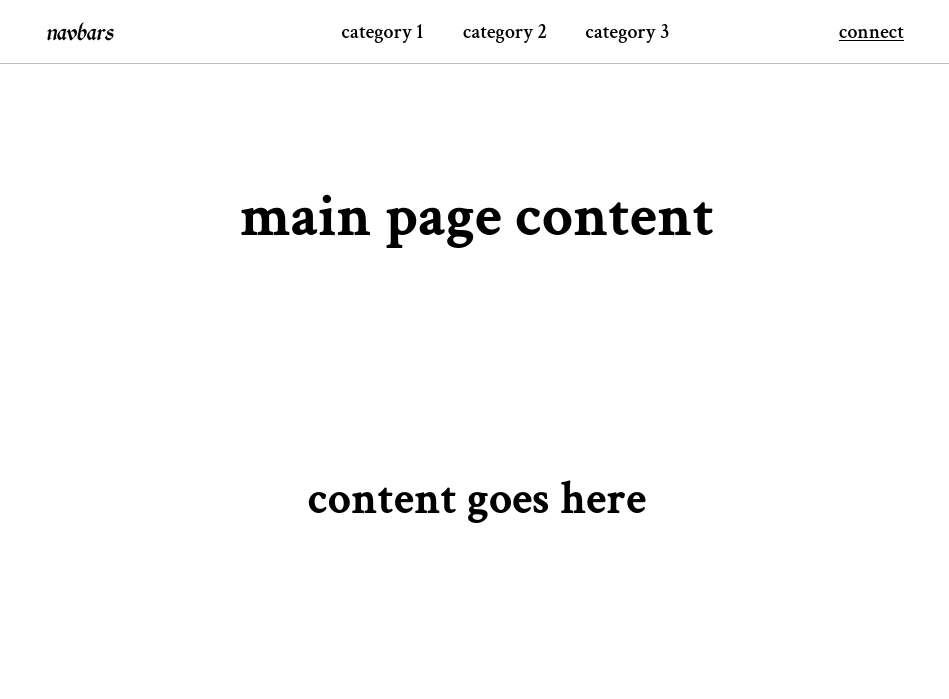
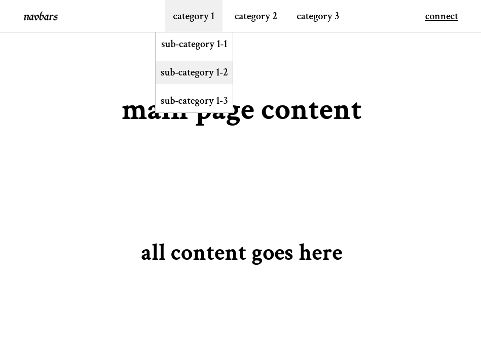
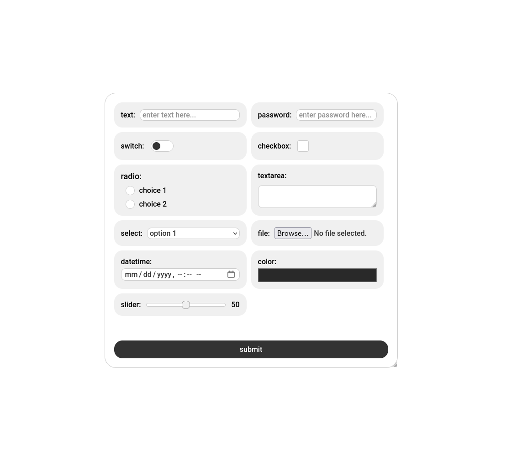
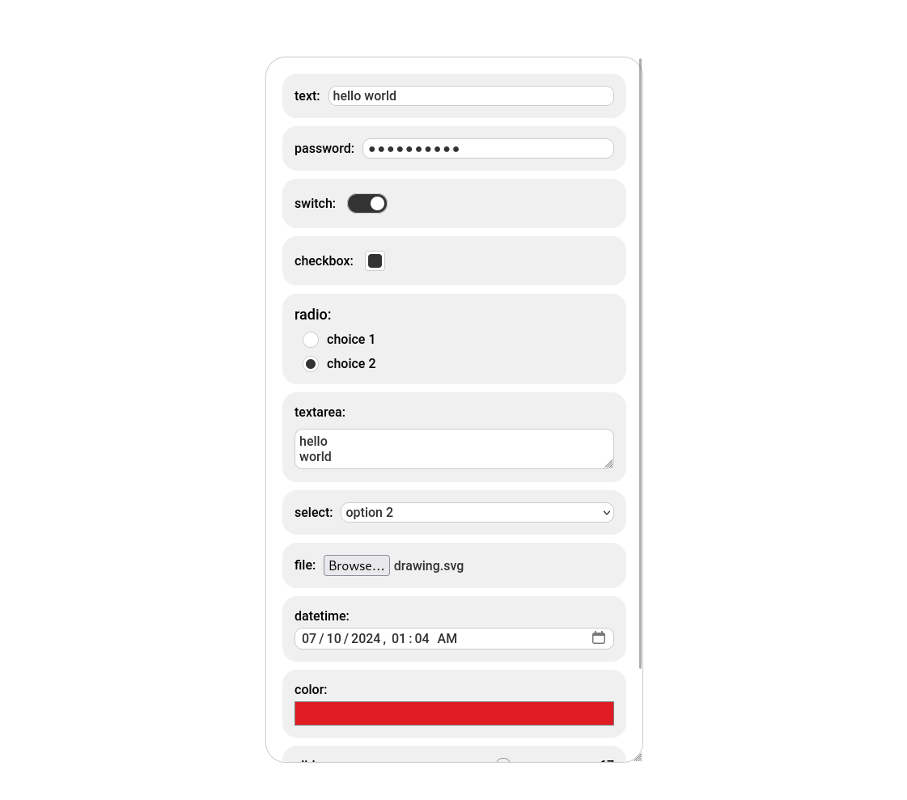

# Level 1: Easy

the first couple of challenges in this series will be a test of your knowledge of basic frontend layout rules. you will be using HTML and CSS only to build common web components.

## Easy 1: Cards

you will be making a responsive page with three centered cards that will wrap responsively with the window borders

### the layout:

- each card is 320px by 420px
- it must contain a cover image taking up the upper half of the card
- a title with bolder text
- a paragraph of content
- a few tags at the bottom

## Easy 2: Navbar

in this challenge we will make a crucial element present in most websites, the navbar its the element typically at the top containing useful navigation links and buttons. they also often contain openable sub-menus that hide more links

### the layout:

- the navbar must be fixed to the top of the website
- it must take full width and have a height of 64px
- three main islands:
  - the logo, usually takes you to the main page
  - sub menu toggles, they show up a list of links when hovered
  - more links
- for additional points you can make the menus using css features only

# Level 2: Medium

on the second level of challenged we will be moving into more complex layouts and getting to use javascript to add more advanced functionality to our designs

## Medium 1: form

in this challenge you will make a responsive and resizable input form with custom themed components

### the layout:

- the whole form is centered to the middle of the page and must initially start with a fixed height and width, then it can be resized by the user
- the inputs follow responsively the resizing of the container and are layed-out as one or two columns accordingly
- each input component is wrapped in container that gives it a padding and a subtle background

### the inputs

- text: simple and basic, allows users to type and fill in information
- password: similar to basic text but hides he user inputs as dots
- checkbox: can be either toggled on or off
- switch: similar to the checkbox it is animated to look like a switch
- radio buttons: only one of these can be on at a time
- textarea: allows for longer text inputs with line breaks, it can also be resized vertically
- selection menu: when opened reveals a menu of options to choose from
- file: allows to upload a file
- datetime: inputs a date and a time
- color: opens a color picker
- slider: slides from left to write allowing to input a number that is displayed on its left

finally, the submit button. it must take full width and be positioned at the bottom of the form

